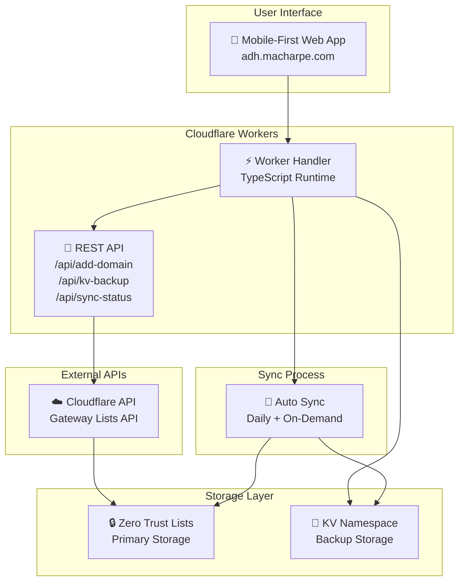

# Allowed Domain Handler

[](https://workers.cloudflare.com/)
[](https://www.typescriptlang.org/)
[](https://www.cloudflare.com/zero-trust/)
[](https://developers.cloudflare.com/kv/)
[](https://adh.macharpe.com)
[](https://adh.macharpe.com)
[](https://www.gnu.org/licenses/gpl-3.0)

[](https://deploy.workers.cloudflare.com/?url=https://github.com/macharpe/allowed-domain-handler)

A modern, mobile-optimized Cloudflare Worker application for managing allowed domains in your Cloudflare Zero Trust Lists with automatic KV backup synchronization.

## 🏗️ Architecture



## ✨ Features

### 🌐 **Web Interface**
- Clean, responsive design optimized for mobile (iPhone)
- Dark mode support with system preference detection
- Real-time form validation and error handling
- Recent submissions tracking (localStorage)

### 🔐 **Domain Management**
- Add domains with descriptions to Cloudflare Zero Trust Lists
- **Multi-list support**: Choose between DNS, HTTP, or both lists
- Domain validation and sanitization
- Duplicate detection and prevention
- Support for both manual and imported domains

### 💾 **Backup System**
- Automatic KV storage backup for all domains
- Daily synchronization from Cloudflare to KV
- Real-time backup of newly added domains
- Full restore capability from backup

### 🛡️ **Security**
- Input validation and sanitization
- Secure API token management
- CORS protection
- Rate limiting ready
- Cloudflare Access authentication integration

## 🚀 Quick Start

### Prerequisites

1. **Cloudflare Account** with Zero Trust enabled
2. **API Token** with specific permissions (see [API Token Setup](#api-token-setup))
3. **Domain List IDs** from Zero Trust Dashboard:
   - DNS Allowed Domains list ID
   - HTTP Allowed Domains list ID (optional, can be the same as DNS)

### Installation

```bash
# Clone and install dependencies
npm install

# Configure environment variables in wrangler.jsonc
# Set your CF_ACCOUNT_ID, CF_DNS_LIST_ID, and CF_HTTP_LIST_ID

# Add API token as secret
wrangler secret put CF_API_TOKEN

# Start development server
npm run dev

# Deploy to production
npm run deploy
```

## 📁 Project Structure

```
src/
├── index.ts              # Main Worker handler
├── types/
│   └── index.ts          # TypeScript definitions
├── handlers/
│   └── html.ts           # Frontend HTML/CSS/JS
├── utils/
│   ├── cloudflare-api.ts # Cloudflare API client
│   ├── kv-sync.ts        # KV backup synchronization
│   ├── validation.ts     # Input validation
│   └── cors.ts           # CORS handling
```

## 🔧 Configuration

### Environment Variables

```json
{
  "vars": {
    "CF_ACCOUNT_ID": "your-cloudflare-account-id",
    "CF_DNS_LIST_ID": "your-dns-zero-trust-list-id",
    "CF_HTTP_LIST_ID": "your-http-zero-trust-list-id"
  }
}
```

**List Configuration**:
- `CF_DNS_LIST_ID`: Zero Trust list for DNS filtering (e.g., "[DNS] Allowed Domains")
- `CF_HTTP_LIST_ID`: Zero Trust list for HTTP filtering (e.g., "[HTTP] Allowed Domains")
- Both IDs can point to the same list if you want unified management

**KV Storage**: The application automatically creates separate KV namespaces for backing up each list:
- `DNS_DOMAINS_BACKUP`: Backup storage for DNS allowed domains
- `HTTP_DOMAINS_BACKUP`: Backup storage for HTTP allowed domains

### Secrets

```bash
# Required: Cloudflare API token
wrangler secret put CF_API_TOKEN
```

### API Token Setup

Create a Cloudflare API Token with the following permissions:

#### Required Permissions
1. **Account:Edit** - Account level permissions
2. **Zero Trust:Edit** - Zero Trust service permissions

#### Token Configuration
- **Token name**: `Allowed-Domain-Handler API Token`
- **Permissions**:
  ```
  Account - Edit (All accounts OR specific account)
  Zero Trust - Edit (All accounts OR specific account)
  ```
- **Account Resources**:
  - Include: All accounts (or select your specific account)
- **Client IP Address Filtering**: Optional (for security)
- **TTL**: Set appropriate expiration date

#### Creating the Token
1. Go to [Cloudflare Dashboard → My Profile → API Tokens](https://dash.cloudflare.com/profile/api-tokens)
2. Click **Create Token**
3. Use **Custom token** template
4. Configure permissions as shown above
5. Copy the token immediately (it won't be shown again)
6. Add it to your Worker: `wrangler secret put CF_API_TOKEN`

> **Security Note**: The token allows editing Zero Trust lists. Store it securely and consider IP restrictions for production use.

### Custom Domain

```json
{
  "routes": [
    {
      "pattern": "adh.macharpe.com",
      "custom_domain": true
    }
  ]
}
```

## 📡 API Endpoints

| Endpoint | Method | Description |
|----------|--------|-------------|
| `/` | GET | Web interface with multi-list selection |
| `/api/add-domain` | POST | Add domain to selected list(s) |
| `/api/kv-backup` | GET | View KV backup data |
| `/api/sync-status` | GET | Check sync status |

### Multi-List Support

The web interface now provides a dropdown to choose which list(s) to add domains to:

- **DNS Allowed Domains only**: Adds to DNS filtering list
- **HTTP Allowed Domains only**: Adds to HTTP filtering list
- **Both DNS and HTTP Allowed Domains**: Adds to both lists (default)

### Example Usage

```bash
# Add a domain to both lists (default)
curl -X POST https://adh.macharpe.com/api/add-domain \
  -H "Content-Type: application/json" \
  -d '{"domain":"example.com","description":"Company website","targetList":"both"}'

# Add a domain to DNS list only
curl -X POST https://adh.macharpe.com/api/add-domain \
  -H "Content-Type: application/json" \
  -d '{"domain":"dns-only.example.com","description":"DNS filtering only","targetList":"dns"}'

# Add a domain to HTTP list only
curl -X POST https://adh.macharpe.com/api/add-domain \
  -H "Content-Type: application/json" \
  -d '{"domain":"http-only.example.com","description":"HTTP filtering only","targetList":"http"}'

# Check backup status
curl https://adh.macharpe.com/api/sync-status

# View all backed up domains
curl https://adh.macharpe.com/api/kv-backup
```

## 🔄 Backup & Sync

The application automatically maintains a backup of all domains in Cloudflare KV storage:

- **Initial Sync**: Imports existing domains on first run
- **Daily Sync**: Re-synchronizes every 24 hours
- **Real-time Backup**: New domains immediately backed up
- **Source Tracking**: Distinguishes between `cloudflare` and `manual` entries

## 🛠️ Development

```bash
# Install dependencies
npm install

# Start development server
npm run dev

# Type checking
npm run typecheck

# Build for production
npm run build

# Deploy to Cloudflare
npm run deploy
```

## 🌐 Live Demo

Visit the live application: **[adh.macharpe.com](https://adh.macharpe.com)**

## 📱 Mobile Support

Fully optimized for mobile devices with:
- Responsive design that adapts to all screen sizes
- Touch-friendly interface elements
- iOS Safari optimizations
- Progressive Web App capabilities

## 🔒 Security Considerations

- All user inputs are validated and sanitized
- API tokens stored securely as Worker secrets
- CORS headers properly configured
- No sensitive data exposed in client-side code
- Rate limiting and abuse prevention ready
- Protected by Cloudflare Access for authentication

## 🔐 Cloudflare Access Setup (Manual Process)

To secure your application with Cloudflare Access:

### 1. Create Access Application

1. Navigate to **Zero Trust → Access → Applications** in your Cloudflare dashboard
2. Click **Add an application** and select **Self-hosted**
3. Configure the application:
   - **Application name**: Allowed Domain Handler
   - **Session Duration**: 24 hours (or as needed)
   - **Application domain**: `adh.macharpe.com` (your custom domain)

### 2. Configure Access Policies

1. Create an **Allow** policy:
   - **Policy name**: Authorized Users
   - **Decision**: Allow
   - Configure your authentication methods:
     - Email domain (e.g., `@yourdomain.com`)
     - Email addresses for specific users
     - GitHub organization membership
     - Or any other identity provider you've configured

### 3. Identity Providers

1. Configure identity providers in **Settings → Authentication**:
   - One-time PIN (email-based authentication)
   - GitHub OAuth
   - Google Workspace
   - Microsoft Azure AD
   - Or any supported IdP

### 4. Access Groups (Optional)

1. Create groups for easier policy management:
   - Navigate to **Access → Access Groups**
   - Create groups like "Domain Administrators" or "IT Team"
   - Use these groups in your Access policies

### 5. Test Your Configuration

1. Access your application at `https://adh.macharpe.com`
2. You should be redirected to the Cloudflare Access login page
3. Authenticate using your configured identity provider
4. Upon successful authentication, you'll be granted access to the application

### Benefits of Using Cloudflare Access

- **No code changes required**: Authentication happens at the edge
- **Multiple identity providers**: Support for various authentication methods
- **Audit logs**: Track who accessed your application and when
- **Session management**: Automatic session expiration and renewal
- **Zero Trust security**: Every request is verified

## 🤝 Contributing

This project follows modern TypeScript and Cloudflare Workers best practices. Feel free to submit issues and enhancement requests.

## 📄 License

GPL-3.0 License - see LICENSE file for details.

---

**Built with ❤️ using Cloudflare Workers, TypeScript, and modern web technologies.**
